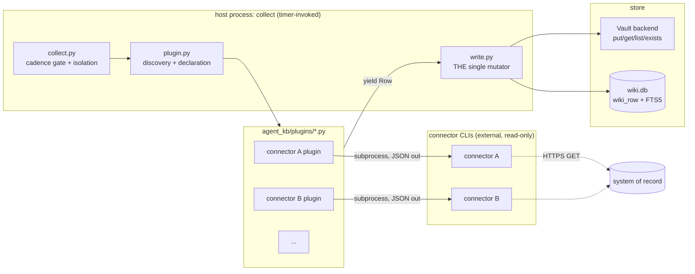
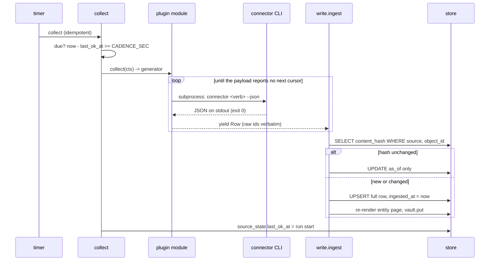
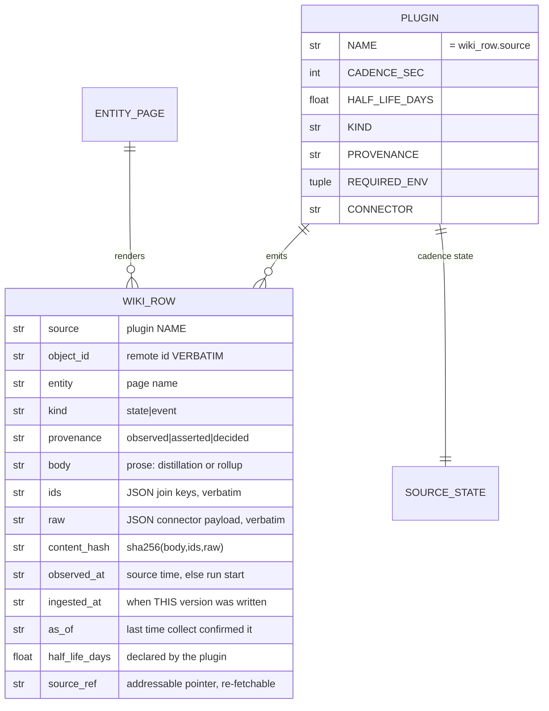

# The collector

Status: proposed, 2026-08-26. Design plus code skeleton. No logic is
implemented; every body in `agent_kb/` is a TODO stub.

This document covers the INGEST half only. The read tools, the MCP surface
and the agent-facing query layer are out of scope.

The collector runs read-only connector CLIs on a schedule, turns their
output into rows in one shared schema, and hands those rows to one mutator
that writes the store. Nothing else.

Prior art for the ingest discipline (distill once at ingest, keyword-index
the raw, per-source freshness, plugin modules emitting a shared row shape):
[How Cerebras Built Its Enterprise Knowledge Base](https://www.cerebras.ai/blog/how-we-built-our-knowledge-base).

## Component diagram



Component responsibilities, one line each:

- `row.py`: the Row dataclass, the content hash, the DDL. The one table.
- `plugin.py`: what a plugin declares, what it receives, how it is found,
  and the one helper that shells out to a connector CLI.
- `vault.py`: 4-method byte store (`put`/`get`/`list`/`exists`) plus the
  local-directory implementation.
- `write.py`: the only code allowed to mutate the store. Holds every
  invariant.
- `collect.py`: argparse entrypoint. Reads cadence, runs due plugins,
  isolates their failures, records state.

## Data flow



connector -> plugin -> row -> write path -> store. The plugin is the only
place that knows a connector's output shape. The write path is the only
place that knows the store. Neither knows the other's business.

## Plugin lifecycle

A plugin is a small Python module under `agent_kb/plugins/`. Not YAML, not
a declarative config format. The module emits rows in the shared schema and
the rest of the stack is unchanged.

1. **Discovery.** `pkgutil.iter_modules` over the `plugins` package,
   `importlib.import_module` each. A module is a plugin if it has module
   level `NAME` and a callable `collect`. Modules starting with `_` are
   skipped. One module failing to import is logged and skipped, never
   fatal.
2. **Declaration.** Module-level constants, validated at load:
   `NAME`, `CADENCE_SEC`, `HALF_LIFE_DAYS`, `KIND`, `PROVENANCE`,
   `REQUIRED_ENV`, `CONNECTOR`. `NAME` becomes `wiki_row.source` and must
   be unique across plugins; a duplicate is a hard error, because two
   plugins sharing a `source` would collide on the object key.
3. **Credential resolution.** SUPERSEDED. This section (and the
   `REQUIRED_ENV`/subprocess-inherits-`os.environ` description below) is
   STALE. `agent_kb/secrets.py` is the authority for the settled
   credential contract: masked `Secret` handles, `<VAR>`/`<VAR>_FILE`
   injection, a hand-built child env that never inherits `os.environ`.
   Full reconciliation of this doc is a separate, not-yet-done job.
4. **Execution.** `collect(ctx) -> Iterator[Row]`. A generator, not a list:
   the write path commits incrementally, so a connector dying on page 9
   still leaves pages 1 to 8 durably stored.
5. **Paging.** The plugin's private business, hidden behind the generator.
   The contract is only "yield every row you can reach". Connectors expose
   paging as a cursor, page number or offset and typically print the next
   cursor to STDERR in their human-readable mode; a plugin must therefore
   request the machine-readable mode and read the cursor out of the parsed
   payload, so stderr stays purely diagnostic. No cursor is persisted
   between runs: every run re-pages from the start and upsert makes that
   free.
6. **Teardown.** None. A plugin owns no resources: no sockets, no
   connections, no temp files. The subprocess is closed by
   `subprocess.run`. If a plugin ever needs teardown, that is a design
   smell to raise before adding a hook.

## Scheduling model

One idempotent `collect` entrypoint, invoked by a system timer. Per-plugin
cadence is a comparison against `source_state.last_ok_at` in sqlite. No
daemon, no scheduler process, no queue, no job table.

```
every 15 min    ->    collect    ->    for each plugin: due? run : skip
```

Why this and not the alternatives:

- **A scheduler daemon** would add a long-lived process, a supervision
  story, a restart story and an in-memory clock that drifts from the
  durable record. It buys sub-minute precision that no source here needs;
  inventory and posture are hourly-to-daily facts.
- **A scheduling library plus a broker** is a dependency tree and a message
  bus for a loop over a handful of plugins. Rejected on sight.
- **Cadence in a config file** rather than in the plugin module would split
  a plugin's definition across two artifacts. The declaration lives with
  the code that produces the rows.

The timer interval is the cadence FLOOR, not the cadence. A plugin
declaring `CADENCE_SEC = 86400` fires on the first tick after 24 hours have
passed. `--force` ignores cadence, `--only NAME` runs one plugin: both
exist for operators, neither changes the durable behaviour.

Concurrency: one writer by construction. `collect` opens the run with
`BEGIN IMMEDIATE`; a second concurrent `collect` gets `SQLITE_BUSY` and
exits non-zero rather than interleaving. This is the whole locking story.

## Failure and retry semantics

There is no retry state machine. The next scheduled run is the retry.

| Failure | Behaviour |
| --- | --- |
| Missing `REQUIRED_ENV` | Plugin skipped, warning, `last_error` set, run continues. |
| Connector exits non-zero | Plugin aborts, rows already yielded stay committed, `last_ok_at` NOT advanced, so the next tick retries. |
| Connector times out | Same as non-zero. Per-invocation timeout, no unbounded wait. |
| Connector stdout is not JSON | Same as non-zero. A parse error is a plugin failure. |
| Partial paging | Whatever was yielded is committed. `last_ok_at` not advanced. Next run re-pages from the first page and upsert makes the redo free. |
| Garbage row (missing `object_id`, unknown `kind`, non-serialisable `ids`) | `write.ingest` rejects that ROW, counts it, and continues with the rest. A bad row never aborts a run and never reaches the store. |
| Plugin raises anything else | Caught per plugin. One plugin's failure never aborts the run or affects another plugin's state. |

A permanently broken plugin therefore retries every tick and logs every
tick. That is deliberate: the log line is the alert, and backoff would only
delay noticing. If tick spam becomes a real problem, add backoff then.

## Idempotency

- **Stable object id.** `(source, object_id)` is the object key.
  `object_id` is the system of record's own identifier, verbatim. Never a
  hash, never a position, never a timestamp. Successive snapshots of the
  same remote object are versions of one row.
- **Content hash.** `sha256` over the canonical JSON of `body`, `ids` and
  `raw`. Timestamps are deliberately excluded, so a source that stamps a
  fresh fetch time on every response does not churn the hash.
- **as_of bump.** Hash unchanged means one `UPDATE wiki_row SET as_of = ?`.
  No new version, no page re-render, no FTS churn. Hash changed means a
  full upsert and `ingested_at` moves to now. `observed_at` is the source's
  own timestamp when it has one, else the run start.
- **Why running collect twice is safe.** Every write is an upsert keyed by
  a remote identifier; the second run recomputes the same hash and bumps
  `as_of` twice. Entity pages are rendered as a pure function of the rows
  for that entity, so re-rendering is a no-op byte-for-byte. There is no
  append-only log to double, no counter to double-increment, and no cursor
  state whose loss changes the result.

## Store

Two halves, one namespace.

**Vault (bytes).** A 4-method abstract base class: `put(key, data)`,
`get(key)`, `list(prefix)`, `exists(key)`, over `str` keys and `bytes`.
One implementation in v1: `LocalVault`, a directory. Keys are vault-relative
POSIX paths and are a trust boundary: `LocalVault` resolves the key under
its root and rejects anything that escapes.

**Rows (sqlite).** `wiki.db` beside the vault, with FTS5 over the raw
payload. External-content FTS5 so the payload is not stored twice.

**The markdown page is the durable record.** Each entity page carries its
rows as fenced JSON blocks under a `## Rows` heading. `wiki.db` is derived
from those pages and rebuildable by `write.rebuild()`, which keeps "raw
markdown is truth, indexes are derived and rebuildable" literally true and
keeps the pluggable backend load-bearing rather than decorative. See open
question 2.

### DDL

```sql
CREATE TABLE IF NOT EXISTS wiki_row (
    id             INTEGER PRIMARY KEY,
    source         TEXT    NOT NULL,
    object_id      TEXT    NOT NULL,
    entity         TEXT    NOT NULL,
    kind           TEXT    NOT NULL
                   CHECK (kind IN ('state', 'event')),
    provenance     TEXT    NOT NULL
                   CHECK (provenance IN ('observed', 'asserted', 'decided')),
    body           TEXT    NOT NULL,
    ids            TEXT    NOT NULL,
    raw            TEXT    NOT NULL,
    content_hash   TEXT    NOT NULL,
    observed_at    TEXT    NOT NULL,
    ingested_at    TEXT    NOT NULL,
    as_of          TEXT    NOT NULL,
    half_life_days REAL    NOT NULL,
    source_ref     TEXT    NOT NULL
);

-- The stable object id. This is the upsert target and the reason
-- re-running collect is free.
CREATE UNIQUE INDEX IF NOT EXISTS wiki_row_object
    ON wiki_row (source, object_id);

-- Name-addressable read: "give me everything about this entity page".
CREATE INDEX IF NOT EXISTS wiki_row_entity ON wiki_row (entity);

-- Freshness sweeps and per-source recency sort.
CREATE INDEX IF NOT EXISTS wiki_row_freshness ON wiki_row (source, as_of);

-- Keyword index over the raw payload and the distilled prose. External
-- content: the text lives once, in wiki_row.
CREATE VIRTUAL TABLE IF NOT EXISTS wiki_row_fts USING fts5(
    entity, object_id, body, ids, raw,
    content = 'wiki_row',
    content_rowid = 'id'
);

CREATE TRIGGER IF NOT EXISTS wiki_row_ai AFTER INSERT ON wiki_row BEGIN
    INSERT INTO wiki_row_fts (rowid, entity, object_id, body, ids, raw)
    VALUES (new.id, new.entity, new.object_id, new.body, new.ids, new.raw);
END;

CREATE TRIGGER IF NOT EXISTS wiki_row_ad AFTER DELETE ON wiki_row BEGIN
    INSERT INTO wiki_row_fts (wiki_row_fts, rowid, entity, object_id,
                              body, ids, raw)
    VALUES ('delete', old.id, old.entity, old.object_id, old.body,
            old.ids, old.raw);
END;

CREATE TRIGGER IF NOT EXISTS wiki_row_au AFTER UPDATE ON wiki_row BEGIN
    INSERT INTO wiki_row_fts (wiki_row_fts, rowid, entity, object_id,
                              body, ids, raw)
    VALUES ('delete', old.id, old.entity, old.object_id, old.body,
            old.ids, old.raw);
    INSERT INTO wiki_row_fts (rowid, entity, object_id, body, ids, raw)
    VALUES (new.id, new.entity, new.object_id, new.body, new.ids, new.raw);
END;

-- Cadence state. One row per plugin. Not a job queue.
CREATE TABLE IF NOT EXISTS source_state (
    source         TEXT PRIMARY KEY,
    last_ok_at     TEXT,
    last_error     TEXT,
    last_error_at  TEXT,
    last_row_count INTEGER NOT NULL DEFAULT 0
);
```

Primary key: `id`, a surrogate that exists only because external-content
FTS5 needs a rowid to join on. The real identity is the unique index
`(source, object_id)`, which is what every upsert targets. Indexed:
`(source, object_id)` unique, `entity`, `(source, as_of)`.

### Field meanings



`ids` is the identifier-preservation field and the first-class invariant of
the write path. It is a flat JSON object of the source's own join keys
(`digest`, `repo`, `namespace`, `service`, `hostname`, `zone_id`,
`rule_id`, `finding_id`, and so on) copied verbatim: no lowercasing, no
trimming, no normalisation, no truncation. `write.ingest` rejects a row
whose `ids` values are not strings. `raw` holds the connector payload as
returned. Distillation produces `body` and may never rewrite `ids` or
`raw`. This is why cross-source joins survive: an agent can walk from an
image digest in one source to a finding in another to a build in a third
without those sources having agreed on anything but the key name.

## Events

Event and log sources do not store raw rows for retrieval. An event plugin
emits ONE row per rollup window: `kind = 'event'`, `object_id` is the
window identity (`<query-id>/<window-start>/<window-end>`), `body` is the
prose rollup, `raw` holds the transform description (window, query,
parameters, result count) rather than the log lines. The auditable object
is the transform, not the rows. Nothing is vectorised, because nothing in
v1 is vectorised.

## What we are NOT building in v1

- **No vectors. At all.** No embedding column, no vector table, no
  embedding seam "for later", no pluggable-embedder interface. Keyword and
  FTS5 only. When real searches start missing, add it then; the row schema
  gains a column and nothing else changes.
- No reranker, no rank fusion, no query expansion, no context expansion.
- No planner in the service.
- No edge table, no `path()` primitive, no graph traversal. The agent joins
  with successive cheap queries.
- No scheduler daemon, no job queue, no worker pool, no retry state
  machine, no backoff.
- No secret store, no credential broker, no access control. Environment
  variables and filesystem permissions.
- No HTTP surface. `collect` is a module you run. The read side gets a
  service later; the ingest side does not need one.
- No incremental cursors persisted between runs.
- No reimplementation of any connector's API client. Connectors are shelled
  out to, unchanged.
- No delete or tombstone semantics. A remote object that disappears keeps
  its last row with a stale `as_of`; staleness is the signal. Revisit only
  if stale rows start misleading agents.

## Dependencies

None. Standard library only: `sqlite3`, `pathlib`, `hashlib`,
`dataclasses`, `importlib`, `pkgutil`, `argparse`, `subprocess`, `json`,
`abc`, `datetime`. Specifically rejected: a filesystem abstraction library
(see open question 1), a YAML parser (frontmatter here is scalar-only), any
scheduler library, any HTTP client (the connectors own that).

## Layout

```
agent_kb/
    __init__.py            package docstring, nothing else
    row.py                 Row dataclass, content hash, DDL, connect
    plugin.py              Declaration, CollectContext, Protocol,
                           run_connector, discover
    vault.py               Vault ABC (put/get/list/exists) + LocalVault
    write.py               ingest() the single mutator, render, rebuild
    collect.py             argparse entrypoint, cadence gate, isolation
    plugins/
        __init__.py
        example_connector.py   worked example, fictional connector
```

One flat package at the repo root, no `src/` and no `scripts/` prefix: the
repo has exactly one deliverable, so a nested or prefixed layout would add
a path component that carries no information. Entry point is
`python3 -m agent_kb.collect`, which needs no packaging metadata, no console
script and no install step.

## Open questions

1. **A filesystem abstraction library, or a 4-method ABC?** Options: (a)
   `Vault` ABC plus `LocalVault`, roughly 20 lines of stdlib, one
   implementation; (b) a general filesystem abstraction library, which
   brings object-store, network-share and HTTP backends for free plus a
   dependency, a transitive tree, and a surface far wider than four
   methods. **Recommendation: (a).** The only backend that exists today is
   a local directory, (b) would be the first dependency in a deliberately
   stdlib-only repo, and the day an object-store backend is actually
   needed, it is four methods behind the same ABC, or (b) slots in behind
   that ABC with zero call-site changes. The ABC is the thing that makes
   the choice reversible, so make it now and defer the dependency.
2. **Is the markdown page the durable record, or is sqlite?** Options: (a)
   page-as-record, rows serialised as fenced JSON under `## Rows`, sqlite
   rebuildable from the vault; (b) sqlite-as-record, pages rendered as a
   read convenience and disposable; (c) both, with a sidecar `.jsonl` per
   entity. **Recommendation: (a).** It makes "markdown is truth, indexes
   are derived" literally true, gives the pluggable backend a real job, and
   survives a corrupted `wiki.db` with a rebuild rather than a re-collect.
   Cost: the page is rewritten whenever any of its rows change, and pages
   get noisy for entities with many rows. (b) is cheaper to write and worse
   to recover.
3. **Who writes the prose for event rollups?** Options: (a) a deterministic
   template in the plugin (window, counts, top-N by frequency, the
   identifiers involved); (b) a model call at ingest. The prior art
   distills with a model, and distilling at ingest is the point.
   **Recommendation: (a) for v1.** It is free, deterministic, inspectable,
   and adds no API key to the ingest path. `body` is prose either way, so
   upgrading a single plugin to (b) later changes nothing outside that
   plugin. Confirm you are happy with template-grade rollups first.
4. **Where does the store live?** Options: (a) a root read from
   `AGENT_KB_HOME`, defaulting to `~/.agent-kb`; (b) inside an existing
   knowledge vault. **Recommendation: (a).** Two stores with different
   schemas and different lifecycles should not share a root, and a separate
   root makes "delete it and re-collect" a safe operation.
5. **Is `collect` a module you run, or an endpoint?** Options: (a)
   `python3 -m agent_kb.collect` under a system timer; (b) a `POST
   /collect` endpoint on the future read service, with the timer calling
   it. **Recommendation: (a) for v1, (b) once the read service exists** so
   the ingest and read halves share one process and one disk owner. Worth
   deciding early, because (b) implies the collector must be importable
   without side effects, which the skeleton already assumes.
6. **How does a plugin find its connector CLI?** Connectors live outside
   this repo and are versioned separately, so a connector update can
   silently change a plugin's input shape. Options: (a) resolve the
   connector directory from `AGENT_KB_CONNECTORS`, with the plugin
   declaring `CONNECTOR` as a bare name, and fail loudly when the
   executable is missing; (b) vendor the connectors into this repo.
   **Recommendation: (a).** (b) forks tools that are maintained elsewhere.
   Shelling out at all is deliberate: reimplementing each connector's API
   client is the alternative, and it is worse. `shell=False` with an
   argument list everywhere, never a command string.
7. **Entity naming.** Plugins choose `entity`, which is the page name and
   therefore the join surface for the whole wiki. Options: (a) a documented
   convention, `<source-kind>/<object-type>/<name>`, enforced only by a
   regex in the write path; (b) a registry of legal entity names.
   **Recommendation: (a).** A registry is a second source of truth and a
   merge-conflict generator. Confirm the convention shape before the first
   plugins are written, because renaming entities later means rewriting
   pages.
8. **Does anything derive a ranking scalar from `half_life_days`?** The
   row carries the half life; nothing in the collector uses it. Options:
   (a) leave it purely as carried metadata for the read side to use at
   query time; (b) precompute a decay score at ingest. **Recommendation:
   (a).** A score computed at ingest is stale the moment it is written.
